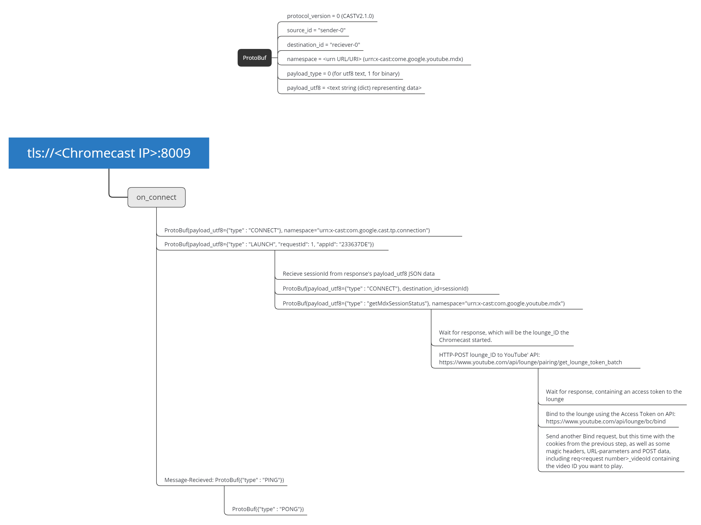

# chromecast
As vanilla as it gets, cast a youtube *(or custom)* video to a chromecast without any dependencies *(No Google or Google-ProtoBuf libs required)*

- [Dependencies](#dependencies)
- [Usage](#usage)
- [Note on ProtoBuf, chromecast and alternatives](#note-on-protobuf-chromecast-and-alternatives)
  * [Protobuf in general](#protobuf-in-general)
    + [`INT` variables](#int-variables-with-a-field-id-of-5)
    + [`string` variables](#string-example-with-a-payload-and-field-id-of-3)
  * [Chromecast specifics](#chromecast-specifics)
    + [protocol_version](#protocol_version)
    + [source_id](#source_id)
    + [destination_id](#destination_id)
    + [namespace](#namespace)
    + [payload_type](#payload_type)
    + [payload_utf8](#payload_utf8)
- [Honorable mentions](#honorable-mentions)

# Dependencies

None! this script is written in pure vanilla Python 3+.

# Usage

    python chromecast.py <ip to chromecast> <YouTube video id>

For instance:

    python chromecast.py 192.168.0.10 ZTidn2dBYbY

Or feed a custom mp4 URL to the script *(Currently mp4 is a hardcoded header until I figure something out)*:

    python chromecast.py 192.168.0.10 http://commondatastorage.googleapis.com/gtv-videos-bucket/sample/BigBuckBunny.mp4

*Note:* To find your chromecasts, you can use `avahi-browse -tr _googlecast._tcp` or `nmap --open -sS -Pn -n -p 8009 192.168.0.0/24` *(Replace the subnet with your own and look for `8009/tcp open`)*.

# Note on ProtoBuf, chromecast and alternatives

Two things. The first being - just use [pychromecast](https://github.com/home-assistant-libs/pychromecast) or [casttube](https://github.com/ur1katz/casttube). They're more fully fledged. 

Secondly, Google heavily uses their open protocol called [protobuf](https://developers.google.com/protocol-buffers/docs/encoding). 
It's essentially just a `struct` -> `bytes` serializer. I've included a very crude serializer & de-serializer for sending and reading protobuf streams. A quick overview of how that works would be:

## Protobuf in general

    Variable type overview:
    | <field ID> | <Variable Type> | <Variable Data> |

Below are two examples describing the most common variables found in a chromecast session.

### `INT` variables with a field ID of 5:

	| 00101 | 000 | 0001 1000 |

The value of this integer would be `24`, and it's up to the developer to define what field `5` should be. 
In chromecast world, that's `payload_type`, so that would normally have a int value of `0` for `utf8` string payload.

### `string` example with a payload and field ID of 3:

	| 00011 | 010 | 0001 0011 | {"type": "CONNECT"}

The field ID *(`00011`)* is 3. And the variable type *(`010`)* is `string`. 
The length of the string is the next byte, which in this case is 19 *(`0001 0011`)*.

The payload is `{"type": "CONNECT"}`. That's the basics of ProtoBuf.

## Chromecast specifics

Chromecast has a set of fields that needs to be defined in a ProtoBuf format. 
Those fields are:

 * protocol_version `::int`
 * source_id `::str`
 * destination_id `::str`
 * namespace `::str`
 * payload_type `::int`
 * payload_utf8 `::str`

And the order is very important. Because the field_id is in the data stream and they need to come in a certain order to match on both sides.

The names however can be anything, but the type - meaning - and order is important. 
But the names are just for your convenience and you can decide to name them whatever you want.

### protocol_version

Protocol version just tells chromecast which protocol to talk. Currently that's `v2.1.0` which is represented by the int `0`. So a lonely ZERO (0) defines that.

### source_id

Source ID is the sender *(or caster's)* id. This can *probably (!?)* be anything you want. 
But in reality the magic keyword of `sender-0` seams to do the trick.

### destination_id

This field changes depending on what casting-state you're in. 
It starts off with the magic keyword of `receiver-0` but once an application has been launched,
this should be changed to whatever the instance-id is of that application - letting the chromecast know you're talking to the application and not the chromecast.

There's also a magic keyword `Tr@n$p0rt-0` which feels like an odd design choice. But is used by the chromecast to send heartbeat information in the shape of `{"type":"PING"}` with the sender and receiver-id's being `Tr@n$p0rt-0`. Not sure why, seams like an odd implementation thing.

### namespace

Namespace is the URN *(or URI/URL if you're more familiar with those terms)* in which you want to call or talk to. Lets say you want to talk to the YouTube app, you need a namespace URN of: `urn:x-cast:com.google.youtube.mdx` in order to let the chromecast know you want to talk to the YouTube app. All applications have their own URN's, and I don't know how you can find those other than [finding URN's in other libraries](https://github.com/home-assistant-libs/pychromecast/blob/0c1d904ab15b91922c8ac45cb7e6641201910578/pychromecast/controllers/plex.py#L178) or listening for the `namespaces` response when launching an app *(which requires you to know an app ID to launch)*.

### payload_type

The payload type can be two different types, either `bytes` or `utf8` strings. I think chromecast supports both. But sticking to `utf8` strings are quite simple and works for most cases talking to the youtube and the generic media app heh. So keep the type `0` for `utf8` strings *(`1` for `bytes` payloads as a reference)*.

### payload_utf8

The payload contains the actual data being sent back and fourth for parsing. 
For instance, the `{"type": "CONNECT"}` payload is meant to connect a session to the chromecast or an app on the chromecast.

`{"type": "PING"}` is another common one that should be replied with `{"type": "PONG"}`.
The different data payloads, in which order they come/should be sent can be seen in this very crude flowchart:

# Honorable mentions

 * [Perth Linux User Group](http://plug.org.au/)'s [talk from 2016](https://docs.google.com/presentation/d/1X1BdFunVnLkF7L0BgevH2zzkcSe0_gtdTJ_pMdEuakQ/htmlpresent).
 * [pychromecast](https://github.com/home-assistant-libs/pychromecast) Which had a lot of `URN`'s that could be re-used.
 * [casttube](https://github.com/ur1katz/casttube) Which had all the YouTube Web-API's to manage a YouTube lounge.
 * Google for making the [ProtoBuf](https://developers.google.com/protocol-buffers/docs/encoding) protocol very open and easy to deconstruct.
